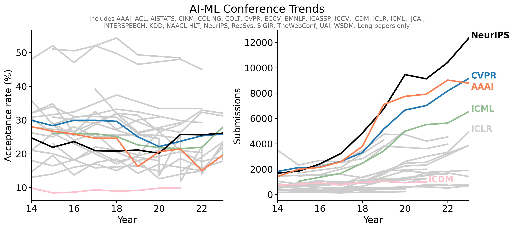

# 数据采集来源

## 1. LetPub

LetPub 是ACCDON旗下为非英语国家科研学者提供优质SCI论文编辑和各类相关服务的专业品牌，为众多研究院所和公司提供各类论文、基金、文书编辑服务，其中也为期刊数据的整理做了比较完善的工作，可以较为方便地查看学术期刊的论文信息。

该网站主要有两种模式可以采集信息，一者为缩略模式下可以以领域或者某个特定检索范围从一个页面批量获取不同期刊的简单信息，一者为某一个期刊的详细信息页面，具体如下。

### 1.1 缩略模式下的数据提取

由于本人相对只关心计算机领域的期刊信息，因此只选择了计算机科学、工程技术、地球科学、数学、物理与天体物理、环境科学与生态学、材料科学、综合性期刊这些领域，并且进行筛选，选择仅仅被SCI收录、影响因子大于5、至少是中科院三区以上的期刊，并且以缩略模式获取的详细主页链接作为索引以方便获取更加详细的数据。

1.  期刊基本的信息

    * [X] ISSN：学术刊物最基本的信息，在数据完整的情况下完全可以当做主键使用
    * [X] 期刊名
    * [X] 大类学科：如计算机科学
    * [X] 小类学科：如人工智能
    * [X] 该期刊在LetPub网站上详细主页的链接

2.  期刊评估信息
   
    * [X] h-index：期刊有 h 篇文章每篇至少被引用 h 次的最大值
    * [X] CiteScore：期刊被引用次数的综合评价指标，越高表示期刊被引用的文章质量越高
    * [X] LetPub网站上网友评分平均，10分制，考虑声誉、影响力、速度
    * [X] 中科院分区：大类学科上对应的中科院分区
    * [ ] SCI是否收录
    * [X] 录用比例：网友的描述性语句
    * [X] 审稿周期：网友的描述语句

### 1.2 详细信息的数据提取

本部分仅仅列出详细页面中具有的相对重要的信息，由于LetPub网站对于爬虫有一定检测，故没有对上一步获取的所有链接一一爬取，可留待后续处理。

1.  期刊基本的信息

    * [X] ISSN：学术刊物最基本的信息，在数据完整的情况下完全可以当做主键使用
    * [ ] E-ISSN：期刊的电子版本的ISSN
    * [X] 期刊名
    * [ ] 期刊简介
    * [X] 大类学科：如计算机科学
    * [X] 小类学科：如人工智能
    * [ ] 出版周期：如月刊年刊等
    * [ ] 出版商
    * [ ] 出版国家或地区
    * [ ] 出版语言
    * [ ] 年文章数
    * [ ] 研究型文章占比：研究型文章/(研究型文章+综述文章)

2.  期刊评估因子
   
    * [X] h-index：期刊有 h 篇文章每篇至少被引用 h 次的最大值
    * [X] CiteScore：Scopus中系列期刊指标的一部分，越高表示期刊被引用的文章质量越高
      * [ ] SJR：SCImago 杂志排名
      * [ ] SNIP：源文档标准化影响
      * [ ] CiteScore在不同的小类学科中的分区与排名
    * [ ] 实时影响因子：由于科睿唯安每年6月底会发布上一年度的IF数据，因此1-6月底预测的上一年度实时影响因子非常接近6月底正式发布的数据，而下半年计算的实时影响因子则因为当年年度尚未结束，计入考量的年度引用数会偏少，因此实时影响因子数据会从大约50%逐渐接近真实IF数据，可以按照当前月份数占比来大致估计全年的最终IF值（考虑数据入库延迟，估算全年IF时可适当上浮）
    * [X] 去年一年影响因子，该份数据库大部分可在github上获取
    * [ ] 五年影响因子
    * [ ] JCI期刊引文指标：Journal Citation Indicator，是科睿唯安公司于2021年推出的期刊评价指标，用于衡量期刊近期出版物的引文影响力。它指期刊在前三年期间发表的文章和综述的“学科规范化引文影响力”CNCI的平均值。一个学科类别的平均JCI值为1，如果一本期刊的JCI为1.3, 则说明它的引用影响力比该类别的平均水平高30%
    * [ ] 去年一年的自引率

3.  期刊分区信息

    * [ ] SCI是否收录
    * [ ] JCR分区：根据IF来四等分定，有WOS大类评级和JIF与JCI指标按照不同小类学科的分区和排名
    * [X] 大类学科中科院分区
    * [ ] 大类学科按照中科院分区是否是Top期刊
    * [ ] 小类学科中科院分区
    * [ ] 近四年中国科学院《国际期刊预警名单（试行）》名单


3.  网友评价信息

    * [X] 录用比例：网友的描述性语句
    * [X] 审稿周期：网友的描述语句
    * [X] LetPub网站上网友评分平均，10分制，考虑声誉、影响力、速度


## 2. Guide2Resarch

Guide2Research是一个相对权威的评级网站，对各个大学、全球的计算机科学家等都做有评分，此处采集的是计算机科学领域期刊的排名和会议的排名。

## 2.1 期刊排名信息

计算机科学最佳期刊排名来自此网站[https://research.com/journals-rankings/computer-science](https://research.com/journals-rankings/computer-science)，排名由 Research.com 发布，该网站是计算机科学研究的著名网站之一，自 2014 年以来提供有关科学贡献的可靠数据。

排名基于 Research.com 创建的独特文献计量分数，该分数使用估计的 h 指数和过去三年内认可该期刊的顶尖科学家数量计算得出，规整易于提取的信息主要由一下组成：

* [X] 期刊排名
* [X] 期刊名字
* [X] 顶尖科学家数量
* [X] 该网站给出的Impact Score
* [X] Documents：发文数量
* [ ] 影响因子

但其实对于每个期刊的详细页面还对这个期刊有相对较为详细的描述与可视化，具体详见该网站。

## 2.2 会议排名信息

计算机科学最佳会议排名来自此网站[https://research.com/conference-rankings/computer-science](https://research.com/conference-rankings/computer-science)，排名由 Research.com 发布，该网站是计算机科学研究的著名网站之一，自 2014 年以来提供有关科学贡献的可靠数据。

该排名包含 2023 年 11 月 21 日收集的 D 指数和影响力分数值，它基于对 3,040 多个会议简介和网站的细致分析，规整易于提取的信息主要由一下组成：

* [X] 会议排名
* [X] 会议名字
* [ ] 顶尖科学家
* [ ] 顶尖科学家发表的论文数
* [X] 该网站给出的Impact Score

同样对于每个会议的详细页面还对这个期刊有相对较为详细的描述与可视化，具体详见该网站。

## 3. TH-CPL

清华的这份《清华大学计算机学科推荐学术会议和期刊列表》是以客观数据为基础，以人工为辅，综合评定后对外公布的。TH-CPL推荐目录主要根据近五年来会议/期刊的引用中位数、10H（被引最高的10篇论文的被引数量之和）、年均篇数、H-index等客观指标，期刊还考虑了2个额外指标：影响因子（IF）、特征因子（EF），同时根据CCF等级为基础进行指标相关性分析，由AMiner提供技术支持，对会议/期刊进行量化考核后，根据相关专家的意见进行细微调整，最终对选中的相对优质的会议/期刊的等级进行评定为A或者B级。

对于计算机领域本身的子领域分类，一般均采用以下形式，无论是THCPL还是CCF等表达的含义均一致

| abbr | name                             | ccf_name                           | thcpl_name                     |
|------|----------------------------------|------------------------------------|--------------------------------|
| AI   | Artificial Intelligence          | 人工智能与模式识别               | 人工智能                       |
| CG   | Graphics                         | 计算机图形学与多媒体             | 计算机图形学与多媒体           |
| CT   | Computing Theory                 | 理论计算机科学                   | 计算机科学理论                 |
| DB   | Database/Data Mining/Information Retrieval | 数据库与数据挖掘             | 数据库/数据挖掘/内容检索       |
| DS   | Computer Architecture/Parallel Programming/Storage Technology | 高性能计算                   | 计算机体系结构/并行与分布计算/存储系统 |
| HI   | Computer-Human Interaction       | 人机交互与普适计算               | 人机交互与普适计算             |
| MX   | Interdiscipline/Mixture/Emerging | 综合与交叉                       | 交叉/综合/新兴                 |
| NW   | Network System                   | 计算机网络                       | 计算机网络                     |
| SC   | Network and System Security      | 网络与信息安全                   | 网络与信息安全                 |
| SE   | Software Engineering/Operating System/Programming Language Design | 系统软件与软件工程           | 软件工程/系统软件/程序设计语言 |


完整的推荐目录可从网络获取，本实验采集中将其提取成具有多个字段的csv规整数据，具体字段如下：

* [X] name: 会议或者期刊全名，虽然直接从正式官方文件获取的可能会和一般熟知的名字有些许小出入，并不一定能完全匹配，比如有些会议会加上IEEE或者IEEE/CVF前缀等，在字符串上并不能做到完全匹配
* [X] abbr：对应上表中唯一确定的英文缩写
* [X] thcpl_rank：TH-CPL推荐目录中该会议或者期刊的排名，为A或者B
* [X] type：表明当前记录是会议或期刊
* [X] field：清华大学官方目录给出的中文领域名字

## 4. CCF

《中国计算机学会推荐国际学术会议和期刊目录》（简称《目录》）是中国计算机学会发布的评级。《目录》由CCF学术工委主持并组织CCF相关领域的专家完成评定，分为三个阶段：提议受理阶段、领域责任专家审议和初审推荐阶段、以及终审核准阶段。CCF推荐目录的确定既考虑了会议和刊物的影响力，也考虑了不同领域间的大致平衡，最终对会议和刊物分十个领域评定了 A、B、C 三类。

其中，会议论文指“Full paper”或“Regular paper”（正式发表的长文），对于会议上其他形式发表的论文如Short paper、Demo paper、Technical Brief、Summary以及作为伴随会议的Workshop等不计入目录考虑的范围。

形式上和TH-CPL类似，仅仅在子领域中文名字上和TH-CPL有些许差别，故不单独列出采集的数据字段形式。

## 5. CORE

CORE是澳大利亚计算研究和教育协会发布的评级指标，会议排名由一系列指标确定，包括：综合引用率，论文提交和接受率，以及主持会议和管理人员的知名度和研究记录等，最终将各个会议分为A*、A、B、C四类。除此，目录还包括澳洲会议、尚未做出等级决定会议，国家或地区举行的不知名会议等，此部分在本数据采集任务重将其直接**清洗筛选去除**。

数据来源可以直接去官网选择适当年份直接导出，会议近年数据有2017、2018、2020、2021、2023年，具体详见官网。


## 6. CAS

对于期刊来说中科院有在国内相对权威的分区评级制度，以及对某些国际期刊会逐年发布预警名单，故在本实验中也考虑中科院的数据，不过由于在LetPub中提供十分详细，已经包括大类学科、小类学科的分区排名等数据，故在本处不单列。

## 7. Conference Accepted Rate

数据主要来源于[https://github.com/lixin4ever/Conference-Acceptance-Rate](https://github.com/lixin4ever/Conference-Acceptance-Rate)与[https://github.com/ccfddl/ccf-deadlines](https://github.com/ccfddl/ccf-deadlines)两个仓库，前者主要以Markdown表格的形式存储，并且有一定可视化如下图



后者以由网友整理成相对规整的`yaml`数据，以ICML为例，其数据格式如下：

```yaml
- title: ICML
  accept_rates:
  - year: 2023
    submitted: 6538
    accepted: 1827
    str: 27.9%(1827/6538 23')
    rate: 0.279443254817987
    source: https://github.com/lixin4ever/Conference-Acceptance-Rate
  - year: 2024
    submitted: 9473
    accepted: 2609
    str: 27.5%(2609/9473 24')
    rate: 0.2754143
    source: https://csconfstats.xoveexu.com/
```
其中既有会议缩写，也有会议在不同年份的提交数、接受数、接受率、数据来源以及描述性字符串。

## 8. CCFDDL    

此部分数据大部分来源于(https://github.com/ccfddl/ccf-deadlines)[https://github.com/ccfddl/ccf-deadlines]仓库，该仓库整理了大量的优质会议的开会时间地点、注册deadline、提交deadline，也整理成了非常规整的`yaml`格式，以ICML为例，其数据格式如下：

```yaml
  - title: ICML
    description: International Conference on Machine Learning
    sub: AI
    rank:
      ccf: A
      core: A*
      thcpl: A
    dblp: icml
    confs:
      - year: 2022
        id: icml22
        link: https://icml.cc/Conferences/2022
        timeline:
          - abstract_deadline: '2022-01-20 23:59:00'
            deadline: '2022-01-27 23:59:00'
            comment: Mandatory abstract deadline on Jan 20, 2022.
        timezone: UTC-12
        date: July 17-23, 2022
        place: Baltimore, Maryland USA
      - year: 2023
        id: icml23
        link: https://icml.cc/Conferences/2023
        timeline:
          - abstract_deadline: '2023-01-09 07:59:59'
            deadline: '2023-01-26 07:59:59'
            comment: Paper Submissions Open on OpenReview Jan 09 2023 02:00 PM UTC
        timezone: UTC-12
        date: July 23-29, 2023
        place: Hawaii Convention Center,Hawaii, USA
      - year: 2024
        id: icml24
        link: https://icml.cc/Conferences/2024
        timeline:
          - deadline: '2024-02-01 23:59:59'
            comment: Paper Submissions Open on OpenReview Jan 09 2024 02:00 PM UTC
        timezone: UTC-12
        date: July 21-27, 2024
        place: Messe Wien Exhibition Congress Center, Vienna, Austria
      - year: 2025
        id: icml25
        link: https://icml.cc/Conferences/2025
        timeline:
          - deadline: '2025-01-30 23:59:59'
            comment: Paper Submissions Open on OpenReview Jan 08 2025 11:59 PM UTC
        timezone: UTC-12
        date: July 11-19, 2025
        place: Vancouver Convention Center, Vancouver, Canada
```
其中包含了会议的缩写、全称、会议类型、CCF/CORE/TH-CPL等级、dblp标识符、会议时间、地点、提交deadline、注册deadline等信息。

## 9. impact_factor

在GitHub上有仓库[https://github.com/suqingdong/impact_factor](https://github.com/suqingdong/impact_factor)已经对期刊的影响因子进行了一定地整理，并且整理成了一张数据表以数据库的形式存放，故在本次采集实验中期刊的影响因子均来源于此，以下是该份数据库中的字段：

* [ ] nlm_id: 医学相关，暂时不考虑集成
* [X] ISSN
* [X] E-ISSN
* [X] journal：期刊全名
* [ ] journal_abbr：期刊缩写，此处不同机构的缩写差别有点大，没收录进来
* [X] factor：影响因子
* [X] jcr：JCR分区

## 10 ShowJCR

[ShowJCR](https://github.com/hitfyd/ShowJCR.git)是一个GitHub收集JCR数据相对多且全面的仓库，不但收录了多年的JCR评级变化，还有中科院分区历年评级、CCF历年评级以及中科院国际期刊预警名单等信息，但是由于多源数据异构性太大，暂时没能将其与前面的数据集成起来。