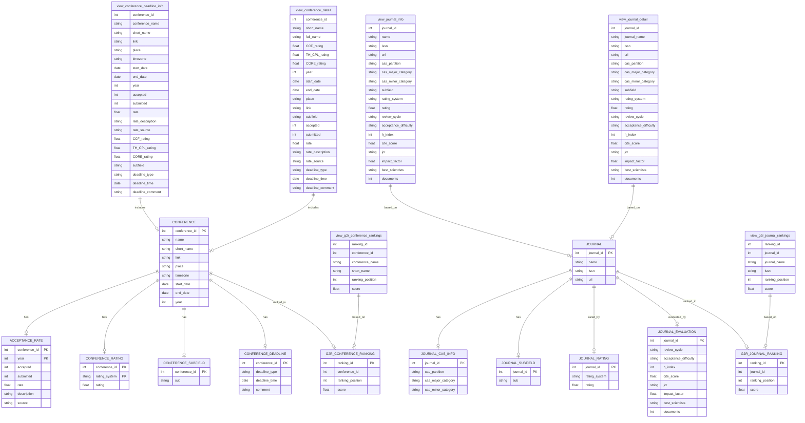

# 数据库Schema设计

```mermaid
erDiagram
    ComputerSubfield {
        VARCHAR sub PK
        VARCHAR english_name
        VARCHAR thcpl_chinese_name
        VARCHAR ccf_chinese_name
    }
    Conference {
        INT conference_id PK
        VARCHAR name
        VARCHAR short_name
        VARCHAR link
        VARCHAR place
        VARCHAR timezone
        DATE start_date
        DATE end_date
        INT year
    }
    Journal {
        INT journal_id PK
        VARCHAR name
        VARCHAR issn
        VARCHAR url
    }
    ConferenceSubfield {
        INT conference_id FK
        VARCHAR sub FK
    }
    ConferenceRating {
        INT conference_id FK
        ENUM rating_system
        VARCHAR rating
    }
    AcceptanceRate {
        INT acceptance_rate_id PK
        INT conference_id FK
        INT year
        INT accepted
        INT submitted
        FLOAT rate
        TEXT description
        VARCHAR source
    }
    G2R_ConferenceRanking {
        INT ranking_id PK
        INT conference_id FK
        INT ranking_position
        FLOAT score
    }
    ConferenceDeadline {
        INT deadline_id PK
        INT conference_id FK
        VARCHAR deadline_type
        DATETIME deadline_time
        TEXT comment
    }
    JournalSubfield {
        INT journal_id FK
        VARCHAR sub FK
    }
    JournalRating {
        INT journal_id FK
        ENUM rating_system
        VARCHAR rating
    }
    JournalCASInfo {
        INT journal_id PK
        VARCHAR cas_partition
        VARCHAR cas_major_category
        VARCHAR cas_minor_category
    }
    Journal_Evaluation {
        INT journal_evaluation_id PK
        INT journal_id FK
        VARCHAR review_cycle
        VARCHAR acceptance_difficulty
        INT h_index
        FLOAT cite_score
        VARCHAR jcr
        FLOAT impact_factor
        INT best_scientists
        INT documents
    }
    G2R_JournalRanking {
        INT ranking_id PK
        INT journal_id FK
        INT ranking_position
        FLOAT score
    }

    %% Relationships
    Conference ||--o{ ConferenceSubfield : "has"
    ComputerSubfield ||--o{ ConferenceSubfield : "relates to"
    Conference ||--o{ ConferenceRating : "rated by"
    Conference ||--o{ AcceptanceRate : "tracks"
    Conference ||--o{ G2R_ConferenceRanking : "ranked in"
    Conference ||--o{ ConferenceDeadline : "has deadline"
    Journal ||--o{ JournalSubfield : "categorized in"
    ComputerSubfield ||--o{ JournalSubfield : "relates to"
    Journal ||--o{ JournalRating : "rated by"
    Journal ||--o{ JournalCASInfo : "classified as"
    Journal ||--o{ Journal_Evaluation : "evaluated as"
    Journal ||--o{ G2R_JournalRanking : "ranked in"
```

# 数据库视图设计

```mermaid
erDiagram
    CONFERENCE {
        int conference_id PK
        string name
        string short_name
        string link
        string place
        string timezone
        date start_date
        date end_date
        int year
    }
    ACCEPTANCE_RATE {
        int conference_id PK
        int year PK
        int accepted
        int submitted
        float rate
        string description
        string source
    }
    CONFERENCE_RATING {
        int conference_id PK
        string rating_system PK
        float rating
    }
    CONFERENCE_SUBFIELD {
        int conference_id PK
        string sub
    }
    CONFERENCE_DEADLINE {
        int conference_id PK
        string deadline_type
        date deadline_time
        string comment
    }
    G2R_CONFERENCE_RANKING {
        int ranking_id PK
        int conference_id
        int ranking_position
        float score
    }

    JOURNAL {
        int journal_id PK
        string name
        string issn
        string url
    }
    JOURNAL_CAS_INFO {
        int journal_id PK
        string cas_partition
        string cas_major_category
        string cas_minor_category
    }
    JOURNAL_SUBFIELD {
        int journal_id PK
        string sub
    }
    JOURNAL_RATING {
        int journal_id PK
        string rating_system
        float rating
    }
    JOURNAL_EVALUATION {
        int journal_id PK
        string review_cycle
        string acceptance_difficulty
        int h_index
        float cite_score
        string jcr
        float impact_factor
        string best_scientists
        int documents
    }
    G2R_JOURNAL_RANKING {
        int ranking_id PK
        int journal_id
        int ranking_position
        float score
    }

    CONFERENCE ||--o| ACCEPTANCE_RATE : has
    CONFERENCE ||--o| CONFERENCE_RATING : has
    CONFERENCE ||--o| CONFERENCE_SUBFIELD : has
    CONFERENCE ||--o| CONFERENCE_DEADLINE : has
    CONFERENCE ||--o| G2R_CONFERENCE_RANKING : ranked_in

    JOURNAL ||--o| JOURNAL_CAS_INFO : has
    JOURNAL ||--o| JOURNAL_SUBFIELD : has
    JOURNAL ||--o| JOURNAL_RATING : rated_by
    JOURNAL ||--o| JOURNAL_EVALUATION : evaluated_by
    JOURNAL ||--o| G2R_JOURNAL_RANKING : ranked_in

    view_conference_deadline_info {
        int conference_id
        string conference_name
        string short_name
        string link
        string place
        string timezone
        date start_date
        date end_date
        int year
        int accepted
        int submitted
        float rate
        string rate_description
        string rate_source
        float CCF_rating
        float TH_CPL_rating
        float CORE_rating
        string subfield
        string deadline_type
        date deadline_time
        string deadline_comment
    }
    view_conference_detail {
        int conference_id
        string short_name
        string full_name
        float CCF_rating
        float TH_CPL_rating
        float CORE_rating
        int year
        date start_date
        date end_date
        string place
        string link
        string subfield
        int accepted
        int submitted
        float rate
        string rate_description
        string rate_source
        string deadline_type
        date deadline_time
        string deadline_comment
    }
    view_g2r_conference_rankings {
        int ranking_id
        int conference_id
        string conference_name
        string short_name
        int ranking_position
        float score
    }
    view_journal_info {
        int journal_id
        string name
        string issn
        string url
        string cas_partition
        string cas_major_category
        string cas_minor_category
        string subfield
        string rating_system
        float rating
        string review_cycle
        string acceptance_difficulty
        int h_index
        float cite_score
        string jcr
        float impact_factor
        string best_scientists
        int documents
    }
    view_journal_detail {
        int journal_id
        string journal_name
        string issn
        string url
        string cas_partition
        string cas_major_category
        string cas_minor_category
        string subfield
        string rating_system
        float rating
        string review_cycle
        string acceptance_difficulty
        int h_index
        float cite_score
        string jcr
        float impact_factor
        string best_scientists
        int documents
    }
    view_g2r_journal_rankings {
        int ranking_id
        int journal_id
        string journal_name
        string issn
        int ranking_position
        float score
    }

    view_conference_deadline_info ||--o| CONFERENCE : includes
    view_conference_detail ||--o| CONFERENCE : includes
    view_g2r_conference_rankings ||--o| G2R_CONFERENCE_RANKING : based_on
    view_journal_info ||--o| JOURNAL : based_on
    view_journal_detail ||--o| JOURNAL : based_on
    view_g2r_journal_rankings ||--o| G2R_JOURNAL_RANKING : based_on
```