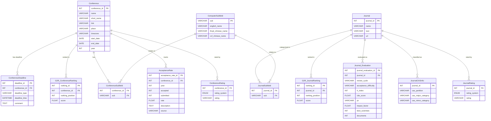

# 数据库Schema设计

```mermaid
erDiagram
    ComputerSubfield {
        VARCHAR sub PK
        VARCHAR english_name
        VARCHAR thcpl_chinese_name
        VARCHAR ccf_chinese_name
    }
    Conference {
        INT conference_id PK
        VARCHAR name
        VARCHAR short_name
        VARCHAR link
        VARCHAR place
        VARCHAR timezone
        DATE start_date
        DATE end_date
        INT year
    }
    Journal {
        INT journal_id PK
        VARCHAR name
        VARCHAR issn
        VARCHAR url
    }
    ConferenceSubfield {
        INT conference_id FK
        VARCHAR sub FK
    }
    ConferenceRating {
        INT conference_id FK
        ENUM rating_system
        VARCHAR rating
    }
    AcceptanceRate {
        INT acceptance_rate_id PK
        INT conference_id FK
        INT year
        INT accepted
        INT submitted
        FLOAT rate
        TEXT description
        VARCHAR source
    }
    G2R_ConferenceRanking {
        INT ranking_id PK
        INT conference_id FK
        INT ranking_position
        FLOAT score
    }
    ConferenceDeadline {
        INT deadline_id PK
        INT conference_id FK
        VARCHAR deadline_type
        DATETIME deadline_time
        TEXT comment
    }
    JournalSubfield {
        INT journal_id FK
        VARCHAR sub FK
    }
    JournalRating {
        INT journal_id FK
        ENUM rating_system
        VARCHAR rating
    }
    JournalCASInfo {
        INT journal_id PK
        VARCHAR cas_partition
        VARCHAR cas_major_category
        VARCHAR cas_minor_category
    }
    Journal_Evaluation {
        INT journal_evaluation_id PK
        INT journal_id FK
        VARCHAR review_cycle
        VARCHAR acceptance_difficulty
        INT h_index
        FLOAT cite_score
        VARCHAR jcr
        FLOAT impact_factor
        INT best_scientists
        INT documents
    }
    G2R_JournalRanking {
        INT ranking_id PK
        INT journal_id FK
        INT ranking_position
        FLOAT score
    }

    %% Relationships
    Conference ||--o{ ConferenceSubfield : "has"
    ComputerSubfield ||--o{ ConferenceSubfield : "relates to"
    Conference ||--o{ ConferenceRating : "rated by"
    Conference ||--o{ AcceptanceRate : "tracks"
    Conference ||--o{ G2R_ConferenceRanking : "ranked in"
    Conference ||--o{ ConferenceDeadline : "has deadline"
    Journal ||--o{ JournalSubfield : "categorized in"
    ComputerSubfield ||--o{ JournalSubfield : "relates to"
    Journal ||--o{ JournalRating : "rated by"
    Journal ||--o{ JournalCASInfo : "classified as"
    Journal ||--o{ Journal_Evaluation : "evaluated as"
    Journal ||--o{ G2R_JournalRanking : "ranked in"
```
